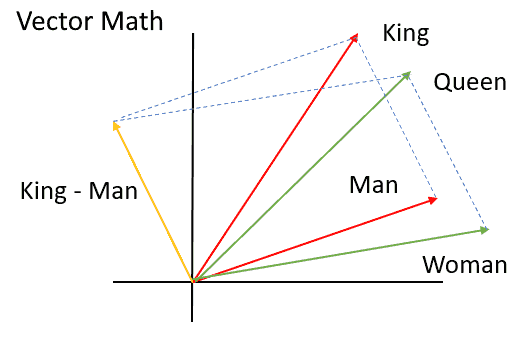

Word Embeddings
===============

Word Meaning
------------

- AI algorithms that work on text need tools to reason about the meaning of words
- Modern computers are built around numbers
- How might we convert the meaning of a word into numbers?

Word Embeddings
---------------

- Create vectors to represent words
- Basis vectors could represent properties of a word
- Consider basis vectors such as `political power` and `gender`. How would a queen be represented? How would congressman be represented?

---

Learning Embeddings
-------------------

- It is tedious to the point of impossibility to manually create embeddings
- What if these could be learned from analyzing texts?

word2vec
--------

- Learns embeddings by analyzing nearby words in a large corpus
- Word similarity is defined as their cosine distance

Example
-------

