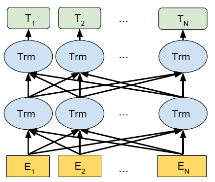

Encoder-only Transformers
=========================

BERT
----

- Bidirectional Encoder Representations from
Transformers
- Encoder-only transformer
- [Paper](https://arxiv.org/pdf/1810.04805.pdf)
- SOTA at most NLP tasks when released

---

---

Training
--------

> Training of BERT BASE was performed on 4 Cloud TPUs in Pod configuration (16 TPU chips total). Training of BERT LARGE was performed on 16 Cloud TPUs (64 TPU chips total). Each pre-training took 4 days to complete.

Pretraining Data
----------------

> For the pre-training corpus we use the BooksCorpus (800M words) and English Wikipedia (2,500M words). For Wikipedia we extract only the text passages and ignore lists, tables, and headers.

Size
----

> We primarily report results on two model sizes: BERTBASE (L=12, H=768, A=12, Total Parameters=110M) and BERTLARGE (L=24, H=1024, A=16, Total Parameters=340M).

Pooling
-------

- Each forward pass through the encoder stack results in one embedding
- This means we have an embedding for each token
- These embeddings must be combined in some way to create uniform sized document embeddings

Mean Pooling
------------

- Simple and commonly used pooling approach
- Takes the average of the last hidden state from all encoder outputs

Vector Search
-------------

- Once we have embeddings we need a way to compare them
- There are several approaches to computing similarity

---

{height=540px}

Dot Product
-----------

Coordinate Definiton

$\mathbf A \cdot \mathbf B = \sum_{i=1}^n A_i B_i = A_1 B_1 + A_2 B_2 + \cdots + A_n B_n$

Dot Product
-----------

Geometric Definiton

$\mathbf{A}\cdot\mathbf{B}=\left\|\mathbf{A}\right\|\left\|\mathbf{B}\right\|\cos\theta$

Cosine Similarity
-----------------

$\cos\theta={\mathbf{A}\cdot\mathbf{B}\over\left\|\mathbf{A}\right\|\left\|\mathbf{B}\right\|}$

For normalized vectors:

$\cos\theta=\mathbf{A}\cdot\mathbf{B}$
