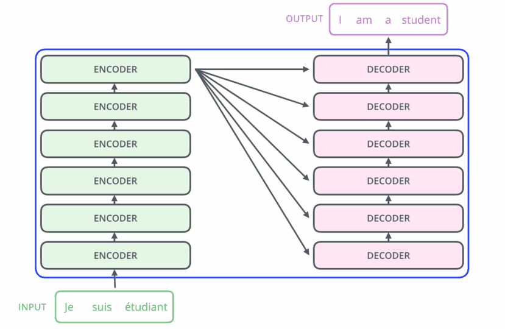

Encoder-only Transformers
=========================

BERT
----

- Bidirectional Encoder Representations from
Transformers
- Encoder-only transformer
- [Paper](https://arxiv.org/pdf/1810.04805.pdf)
- SOTA at most NLP tasks when released

Training
--------

"Training of BERT BASE was performed on 4 Cloud TPUs in Pod configuration (16 TPU chips total).13 Training of BERT LARGE was performed on 16 Cloud TPUs (64 TPU chips total). Each pre-training took 4 days to complete."

---

---

