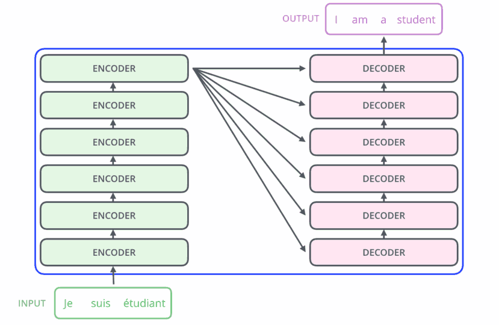
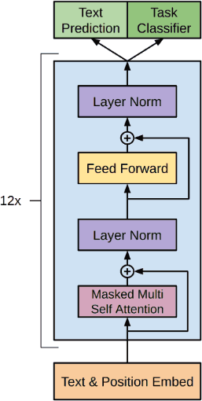

Decoder-only Transformers
=========================

GPT
---

- Generative Pre-Trained Transformer
- Decoder-only transformer
- [Paper](https://s3-us-west-2.amazonaws.com/openai-assets/research-covers/language-unsupervised/language_understanding_paper.pdf)
- SOTA at most NLP tasks when released

---



---



Pretraining Data
----------------

> We use the BooksCorpus dataset for training the language model. It contains over 7,000 unique unpublished books from a variety of genres including Adventure, Fantasy, and Romance.

Size
----

> We trained a 12-layer decoder-only transformer with masked self-attention heads (768 dimensional states and 12 attention heads). For the position-wise feed-forward networks, we used 3072 dimensional inner states.

GPT 1 Example
-------------

```python
from transformers import pipeline

generator = pipeline('text-generation',
                     model='openai-community/openai-gpt')

output = generator("Once upon a time", max_length=50)
print(output[0]['generated_text'])
```


Training Process
----------------

- Data collection, cleaning, and filtering
- Pretraining
- Fine-tuning

Fine-tuning
-----------

- May involved training for specific NLP task (e.g. classification)
- May involve training a model to better respond to instructions

OpenOrca
--------

- One example of a [dataset](https://huggingface.co/datasets/Open-Orca/OpenOrca) for supervised fine-tuning (SFT)
- Open replication of a training set similar to the on described in Microsoft's [Orca paper](https://arxiv.org/abs/2306.02707)

Prompt formats
--------------

- Models are trained using training data in a particular format
- Best results will be obtained when prompting models using a similar format

Openchat Example
-----------------

- [openchat-3.5-0106](https://huggingface.co/openchat/openchat-3.5-0106)
- 7B paramater model fine-tuned for chat
